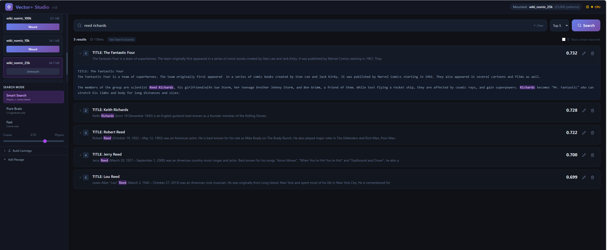

# Vector+ Studio v1.0

**Physics-Enhanced Semantic Search -- Now with a Real Frontend**

Vector+ Studio is a semantic search application powered by a 16-million neuron Hopfield network. Unlike traditional vector databases, queries go through **real neural physics** -- the lattice actively shapes search results through associative memory, not just cosine similarity.

V1.0 replaces the Streamlit prototype with a production React frontend and FastAPI backend.



## What's New in v1.0

### React Frontend + FastAPI Backend

The Streamlit UI has been replaced with a proper web application:

- **React 19 + TypeScript + Tailwind CSS** -- dark neural-themed UI
- **FastAPI backend** with async GPU operations and threading lock
- **Zustand** state management -- lightweight, zero boilerplate
- **Vite** dev server with hot reload

### Full CRUD

- **Create**: Add Passage editor (full-width workspace) + Build Cartridge from files (txt, pdf, docx)
- **Read**: Three search modes (Smart blend, Pure Brain, Fast cosine), keyword highlighting with stemming, Top-K selector, "Must contain keywords" strict filter
- **Update**: Edit Passage via pencil button on result cards -- saves new version, tombstones original (copy-on-write with full undo)
- **Delete**: Trashcan with confirmation bar, soft-delete tombstoning
- **Restore**: Recover any tombstoned pattern from the sidebar panel

### Search Features

- Configurable physics/cosine blend slider (Smart Search mode)
- Keyword reranking with stop-word filtering
- Clear button to reset search results
- CPU/GPU mode indicator with tooltips

### Cartridge Management

- Mount/unmount from sidebar with size and Brain/Sigs badges
- File picker (native OS dialog + paste-a-path fallback)
- Cross-format support: PKL, NPY brain, NPZ signatures, membot .cart.npz
- Explicit Save button with unsaved-changes warning on exit
- Build new cartridges from uploaded documents

### Quick Start (v1.0)

```bash
# Backend
cd vector-plus-studio
pip install -r api/requirements.txt
python -m uvicorn api.main:app --port 8000

# Frontend (separate terminal)
cd frontend
npm install
npm run dev
```

Then open http://localhost:5173 in your browser.

---

# Vector+ Studio v0.83 (Legacy Streamlit UI)

**Physics-Enhanced Semantic Search**


## What's New in v0.83

### L2 Hierarchy Search

Search now uses L2 hierarchy signatures (4096-dim) instead of the legacy `generate_signature()` method. L2 better preserves embedding relationships (0.54 vs 0.47 correlation) and is computed for free during physics settle — no extra pass needed.

### Blended Scoring (70/30)

Default search blends **70% embedding cosine + 30% L2 physics similarity**. The physics component captures associative relationships that pure cosine misses. Configurable via the search panel.

### MCP Server Integration

Brain cartridges can now be served to AI agents via **[Membot](https://github.com/project-you-apps/membot)** (Model Context Protocol). Any MCP-compatible agent (OpenClaw, Claude Code, etc.) can mount a cartridge, search it semantically, and store new memories — all through standard tool calls.

### Additional v0.83 Changes

- L2 signature method recorded in `.npz` signature files (`signature_method: "l2"`)
- Keyword reranking with stop-word filtering and additive boost (capped at +0.12)
- Improved signature capture during training pipeline
- Compatible with MCP Server V3 cartridge format

---

## What's New in v0.82

### Pure Signature Search

Search using only brain signatures - **no embeddings pkl file required**. After training, the lattice captures a 4096-float L2 signature per pattern. Query by imprinting, settling, and comparing L2 cosine similarity. One brain file is all you need.

### V7.2 Protected Rows

Region rows can be frozen through settle physics. Metadata (hippocampus IDs, stored text) survives any number of settle frames at 100% fidelity.

### V7.3 Per-Row Physics Control

8 independent physics flags per row (decay, fatigue, inhibition, weights, Boltzmann, kWTA, learning, top-down). Presets: `0x00` = full physics, `0xFF` = fully protected, `0xBF` = learn-only.

### Additional v0.82 Changes

- Full Pattern Rerank mode via lattice pattern correlation
- Keyword matching with stemming for flexible text search
- Signature capture/storage (.npz) during training pipeline
- Contiguous encoder layout option (packed edge-to-edge)
- L2/L3/L1 hierarchy recall methods
- Cartridge format v8.2 (backward compatible with v7.0-8.1)

## What's New in v0.81

**Vector+ Studio v0.81** introduced **physics-enhanced search** - the neural lattice actively participates in ranking, not just visualization.

### Key Breakthrough: Holographic Storage

The trained "brain" file is **fixed at 128MB regardless of dataset size**:

| Dataset | Embeddings File | Brain File |
|---------|-----------------|------------|
| 10k articles | ~30 MB | **128 MB** |
| 100k articles | ~300 MB | **128 MB** |
| 500k articles | ~1.5 GB | **128 MB** |

This is how biological memory works - patterns are stored holographically in synaptic weights, not as separate records. The same 128MB weight matrix can encode 10k or 500k patterns.

## Features

- **Physics-Enhanced Search**: Queries go through encode → settle → decode pipeline; Hebbian weights shape results
- **Holographic Brain Storage**: 128MB brain file stores unlimited patterns (fixed size!)
- **Background Training**: Train on large datasets without blocking the UI
- **Brain Persistence**: Save/load trained weights - instant remount after first training
- **Neural Lattice Visualization**: See query and result patterns on a 4096x4096 neuron lattice
- **Noise Tolerance**: 86%+ correlation even with 30% input corruption
- **Full-Text Keyword Boost**: Phrase matching in document bodies, not just titles
- **Document Ingestion**: Import PDFs, Word docs, and text files
- **Memory Cartridges**: Save and load document collections

## Quick Start

### Requirements

- Windows 10/11
- NVIDIA GPU with CUDA support
- Python 3.10+

### Installation

```bash
git clone https://github.com/project-you-apps/vector-plus-studio.git
cd vector-plus-studio
pip install -r requirements.txt
```

### Run

```bash
streamlit run vector_plus_studio_v83.py --server.fileWatcherType none
```

Then open http://localhost:8501 in your browser.

**Note:** The `--server.fileWatcherType none` flag prevents unnecessary reloads during use.

### First Search

The first search will take ~30 seconds while the embedding model (Nomic Embed v1.5) downloads and loads. Subsequent searches are fast (~500ms).

## How It Works

1. **Thermometer Encoding**: Each embedding dimension maps to a 64x64 region of the lattice
2. **Hebbian Training**: Patterns are learned into synaptic weights during cartridge mount
3. **Physics-Enhanced Query**: Query embedding is encoded → settled (physics shapes it) → decoded back
4. **Associative Search**: The "physics-cleaned" embedding finds semantic neighborhoods, not just exact matches
5. **Keyword Boosting**: Full-text phrase matching re-ranks top candidates

## Project Structure

```
vector-plus-studio/
├── api/                          # FastAPI backend (v1.0)
│   ├── main.py                   # Endpoints, CORS, lifespan
│   ├── engine.py                 # GPU singleton (MultiLatticeCUDAv7)
│   ├── search.py                 # Search modes (smart, pure brain, fast)
│   ├── cartridge_io.py           # Load/save/list cartridges
│   ├── forge.py                  # File parsing + chunking
│   └── models.py                 # Pydantic schemas
├── frontend/                     # React + Vite + TypeScript (v1.0)
│   └── src/
│       ├── components/           # Header, Sidebar, SearchBar, ResultCard, etc.
│       ├── store/appStore.ts     # Zustand state management
│       └── api/                  # API client + types
├── vector_plus_studio_v83.py     # Legacy Streamlit UI
├── multi_lattice_wrapper_v7.py   # Python wrapper for CUDA engine
├── thermometer_encoder_generic_64x64.py  # Encoding utilities
├── bin/
│   └── lattice_cuda_v7.dll       # Pre-built CUDA physics engine
├── cartridges/                   # Your saved document collections
└── sample_data/                  # Sample datasets
```

## System Requirements

| Component | Minimum | Recommended |
|-----------|---------|-------------|
| GPU | NVIDIA GTX 1060 | NVIDIA RTX 3080+ |
| VRAM | 4 GB | 8+ GB |
| RAM | 8 GB | 16+ GB |
| CUDA | 11.0+ | 12.0+ |

## License

**Dual-Licensed:**

| Component | License | Commercial Use |
|-----------|---------|----------------|
| Python code (`.py` files) | MIT | Yes |
| CUDA Engine (`bin/*.dll`) | Proprietary | [Contact for license](mailto:andy@project-you.app) |

The Python wrapper and utilities are open source under MIT. The compiled CUDA physics engine is free for personal, educational, and non-commercial use. Commercial use requires a separate license - see [bin/LICENSE](bin/LICENSE).

## Links

- [Project You](https://project-you.app) - Parent project

## Future Direction and Updates

- **v1.0 (Current)**: React frontend + FastAPI backend, full CRUD, passage editor, Top-K selector, strict keyword filter
- **v0.83**: L2 hierarchy search, blended 70/30 scoring, keyword reranking, MCP server integration
- **v0.82**: Pure signature search, protected rows, per-row physics control
- **v0.81**: Physics-enhanced search -- queries go through real neural physics
- **Planned**: Edit locking via hippocampus metadata, INT8/binary physics engine, FPGA validation

---

Built with physics, not just math. Patterns stored holographically, not as records.
