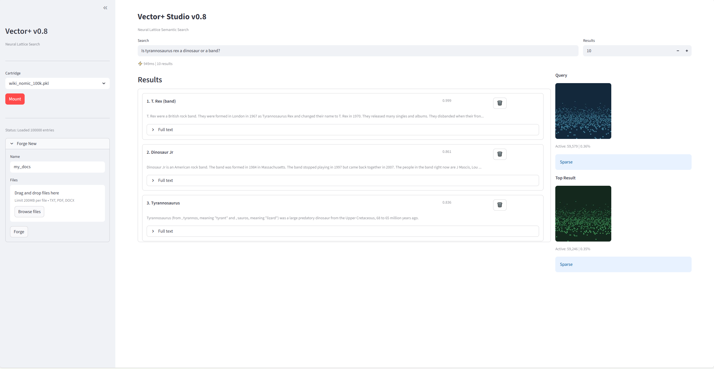

# Vector+ Studio v0.7

**True Content-Addressable Recall via Neural Lattice Physics**

Vector+ Studio is a semantic search application powered by a 16-million neuron physics simulation. Unlike traditional vector databases that rely purely on embedding similarity, Vector+ uses a CUDA-accelerated lattice of spiking neurons to create noise-tolerant, content-addressable memory patterns.



## Features

- **Semantic Search**: Find documents by meaning, not just keywords
- **Neural Lattice Physics**: 4096x4096 neuron simulation with Hebbian learning
- **Noise Tolerance**: 86%+ correlation even with 30% input corruption
- **Document Ingestion**: Import PDFs, Word docs, and text files
- **Memory Cartridges**: Save and load document collections

## Quick Start

### Requirements

- Windows 10/11
- NVIDIA GPU with CUDA support
- Python 3.10+

### Installation

```bash
git clone https://github.com/project-you-apps/vector-plus-studio.git
cd vector-plus-studio
pip install -r requirements.txt
```

### Run

```bash
streamlit run vector_plus_studio_v7.py
```

Then open http://localhost:8501 in your browser.

## How It Works

1. **Thermometer Encoding**: Each embedding dimension maps to a 64x64 region of the lattice
2. **Physics Simulation**: Neurons interact via facilitation, inhibition, and Hebbian learning
3. **Signature Generation**: Each pattern creates a unique 4096-float "fingerprint"
4. **Content-Addressable Recall**: Partial or noisy inputs recover the full pattern

## Project Structure

```
vector-plus-studio/
├── vector_plus_studio_v7.py     # Main Streamlit application
├── multi_lattice_wrapper_v7.py  # Python wrapper for CUDA engine
├── thermometer_encoder_generic_64x64.py  # Encoding utilities
├── bin/
│   └── lattice_cuda_v7.dll      # Pre-built CUDA physics engine
├── cartridges/                   # Your saved document collections
└── sample_data/                  # Sample datasets
```

## System Requirements

| Component | Minimum | Recommended |
|-----------|---------|-------------|
| GPU | NVIDIA GTX 1060 | NVIDIA RTX 3080+ |
| VRAM | 4 GB | 8+ GB |
| RAM | 8 GB | 16+ GB |
| CUDA | 11.0+ | 12.0+ |

## License

**Dual-Licensed:**

| Component | License | Commercial Use |
|-----------|---------|----------------|
| Python code (`.py` files) | MIT | Yes |
| CUDA Engine (`bin/*.dll`) | Proprietary | [Contact for license](mailto:licensing@project-you.app) |

The Python wrapper and utilities are open source under MIT. The compiled CUDA physics engine is free for personal, educational, and non-commercial use. Commercial use requires a separate license - see [bin/LICENSE](bin/LICENSE).

## Links

- [Project You](https://project-you.app) - Parent project
- [Documentation](docs/) - Technical details

---

Built with physics, not just math.
