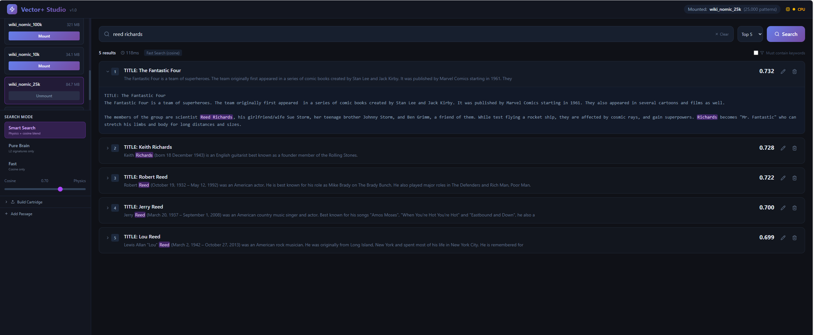
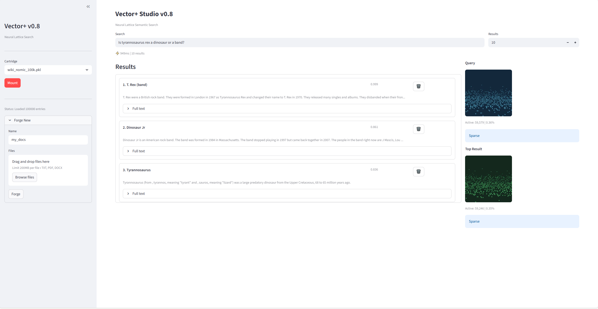

# Vector+ Studio v1.2 — Hosted Demo + Browser-Side Cart Builder + OAuth

**What's new in v1.2:**

- **Auth, per-user private libraries, and saved searches all landed** — There is now user login across all the project-you.app programs. User profiles are forthcoming soon.
- **Multiple sign-ins** — Users can sign in at project-you.app/vps/app via Google / GitHub / email / magic link.
- **Cookie domain is .project-you.app** — This means future Waving Cat apps share the same sign-in and we're GDPR-friendly.
- **Mempack — per-user writable carts** — Now agents can bring their own personal backpack to carry any data they want like research, memories, anything worth keeping.

---

# Vector+ Studio v1.1 — Hosted Demo + Browser-Side Cart Builder

 I built Vector+ Studio (with Claude's help) to answer a specific question: what would search feel like if it found *related* ideas, not just matching words? The substrate is a neuromorphic lattice — physics-based retrieval that finds neighbors-by-meaning rather than nearest-by-distance. Try it at **https://project-you.app/vps/app** on the bundled sample carts, or drop in your own PDFs and the browser will build you a cartridge while you watch. No install, no GPU required. Sign in if you want your own private library; the demo carts are public and ready to search without signup.

**What v1.1 adds on top of the desktop v1.0 product:**

- **Hosted demo** at `https://project-you.app/vps/app` — search any of the bundled sample cartridges (LatticeRunner litepaper, Project You overview, etc.) from your browser
- **Browser-side Cart Builder** — drop in PDF/DOCX/XLSX/TXT files; the page parses, chunks, embeds (WebGPU primary, WASM fallback), and downloads a `.cart.npz` ready to mount anywhere
- **Read-only sandbox** — public users mount carts from a sandboxed directory; no writes, no edits, no leakage between sessions
- **Eject** — bring-your-own carts can be unmounted and removed from the sandbox in one click
- **Same physics engine** — the hosted droplet runs the same `lattice_cuda_v7.dll` as the desktop app, just behind FastAPI

## Quick Start (Hosted Demo)

1. Visit `https://project-you.app/vps/app`
2. Pick a sample cartridge from the sidebar, or build your own from local files
3. Search

No install, no GPU, no signup. The droplet does the physics; your browser handles the build.

## Quick Start (Browser-Side Cart Builder)

The Cart Builder runs entirely in your browser. Your files never leave your machine during the build, so chunking, embedding, and writing all happen client-side via WebGPU (or WASM as a fallback). When you're done you have a `.cart.npz` file you can save locally, mount in the desktop app, or upload to the hosted demo if you want to share it. The cart format is one file; it travels anywhere and can even work without an internet connection. That's the "data tour" idea where *your* knowledge stays *yours*, in a portable artifact you can carry between machines and tools.

1. Open the hosted demo or run locally
2. Click "Build Cartridge" → drop in PDFs/DOCX/XLSX/TXT (up to 50MB total, 10K chunks)
3. Wait — chunking is instant, embedding takes ~30s for a small doc on WebGPU, ~3-5x slower on WASM
4. Download the `.cart.npz`
5. Mount it locally (desktop app) or upload it to the hosted demo for sandbox-mounted search

The browser build uses [transformers.js](https://github.com/xenova/transformers.js) running Nomic Embed Text v1.5 in WebGPU. Output is the same NPZ format as the desktop builder — fully cross-compatible.

## Architecture

```text
Browser                                  Droplet (project-you.app/vps/app)
─────────────────────────────────────    ─────────────────────────────────
Cart Builder (transformers.js + WebGPU)  FastAPI ── Engine (lattice_cuda_v7.dll)
  parse → chunk → embed → write     →    │           │
  download .cart.npz                     │           ├── Sandbox dir (uploads)
                                         │           ├── Bundled carts (read-only)
Search UI (React + Zustand)         ←→   │           └── VPS_READ_ONLY=1 (no writes)
  mount, search, eject                   │
                                         └── nginx (reverse proxy + TLS)
```

The trust boundary is deliberate. Your files only leave your machine if *you* decide to upload the resulting cart. Chunking, embedding, and writing is all on the client-side. The server's job is to mount cartridges you explicitly hand to it and run the physics-based search against them. We never see your raw documents unless you choose to put them in the public sandbox. (And the sandbox is exactly that: a sandbox. TTL'd, ejectable by anyone with the link, never written to the canonical catalog.)

## What v1.1 Does NOT Do (yet)

- **No persistent user state.** Mount/unmount and search work; saved searches, bookmarks, and per-user cart lists do not.
- **No marketplace.** Listing/buying/sharing carts is on the roadmap but not in v1.1.
- **WebGPU-required for fast builds.** The WASM fallback works but is 3-5× slower; on Safari (no WebGPU as of writing) builds are usable but not fast.
- **Auth, per-user private libraries, and saved searches** landing in **v1.2**.

## Browser Compatibility

| Browser | Build (Cart Builder) | Search (Hosted) |
| --- | --- | --- |
| Chrome 113+ / Edge 113+ | WebGPU (fast) | Yes |
| Firefox 121+ (with `dom.webgpu.enabled`) | WebGPU (fast) | Yes |
| Safari 17+ | WASM fallback (slow) | Yes |
| Mobile (any) | WASM fallback (slow) | Yes |

## Security Model

- **Server**: `VPS_READ_ONLY=1` env disables all write endpoints (add/edit/delete/save). Only mount/unmount/search/upload-to-sandbox/eject are reachable.
- **Cart-level**: each cart carries a `.permissions.json` sidecar. Browser-built carts default to `"r"` (read).
- **Pattern-level**: hippocampus row 29 stores per-pattern `perms_byte`. Default `0x03` (read+search) for browser-built carts.
- **Upload validation**: streaming-to-disk with zip-slip protection, zip-bomb cap (200×), entry-type allowlist (`.npy` only). Uploads are quarantined to the sandbox dir; eject removes them.

## RAG+ — Three-Tier Provenance

Generally, a standard vector RAG returns a chunk matching as close to the embedded query as possible. But the provenance of that chunk (the document source filename, etc.) is almost always invisible to the user. This makes verification against the original document cost more work outside of the search tool. I found that frustrating because standard RAG usually lacks a place for that sort of metadata--or if it *does* exist it's tacked on in some sort of sidecar or worse a diskspace-gobbling index file that grows too large very fast.

Vector+ Studio's cart format solves that issue by producing three layers of provenance for every result:

1. **Card preview** — matched text snippet from the in-RAM index (~200 chars). Sub-millisecond cosine + Hamming hit on a compact binary code.
2. **Modal full text** — complete passage from the cart's on-disk source database, fetched on click.
3. **External link** — the canonical source URL (arXiv paper, gutenberg.org poem, original document, etc.). One click, new tab.

All three layers are accessible from every result. Each has a name and a click target. They are stored on the same paired pattern as the embedded text.

This is an architectural property of the split-cart format (NPZ index + SQLite text + URL field), not a feature bolted on. The pattern also holds across encoders because the LatticeRunner substrate technology underneath all of this is "dumb" which is to say it accepts any encoding format for any data stored on it. You can swap the embedding model and the three-tier shape stays identical, because provenance is a property of how the cart is structured, not how the embeddings were computed.

The result: users verify against the original source without trusting the search system. This addresses the RAG-hallucination problem directly.

---

# Vector+ Studio v1.0 — Desktop App with Real Frontend

**Physics-Enhanced Semantic Search -- Now with a Real Frontend**

Vector+ Studio is a semantic search application powered by a 16-million neuron Hopfield network. Unlike traditional vector databases, queries go through **real neural physics** -- the lattice actively shapes search results through associative memory, not just cosine similarity.

V1.0 replaces the Streamlit prototype with a production React frontend and FastAPI backend.



## What's New in v1.0

### React Frontend + FastAPI Backend

The Streamlit UI has been replaced with a proper web application:

- **React 19 + TypeScript + Tailwind CSS** -- dark neural-themed UI
- **FastAPI backend** with async GPU operations and threading lock
- **Zustand** state management -- lightweight, zero boilerplate
- **Vite** dev server with hot reload

### Full CRUD

- **Create**: Add Passage editor (full-width workspace) + Build Cartridge from files (txt, pdf, docx)
- **Read**: Five search modes (Hamming Blend, Smart Search, Pure Brain, Fast cosine, Associate), keyword highlighting with stemming, Top-K selector, "Must contain keywords" strict filter
- **Update**: Edit Passage via pencil button on result cards -- saves new version, tombstones original (copy-on-write with full undo)
- **Delete**: Trashcan with confirmation bar, soft-delete tombstoning
- **Restore**: Recover any tombstoned pattern from the sidebar panel
- **Read-Only Lock**: Cartridges mount locked by default. Explicit unlock required before any writes (add, edit, delete, save). Lock/Unlock toggle in the header with visual state indicator

### Search Features

- Configurable physics/cosine blend slider (Smart Search mode)
- Keyword reranking with stop-word filtering
- Clear button to reset search results
- CPU/GPU mode indicator with tooltips

### Associate Search: Retrieval That Reasons

Traditional vector search finds what *matches*. Associate search finds what *relates*.

**Example:** Query a 10,000-article Wikipedia cartridge with *"What is the ancient explanation for earthquakes?"*

| Mode | #1 Result | #3 Result | Mechanism |
|------|-----------|-----------|-----------|
| **Hamming Blend** | Earthquake | Poseidon (#2) | Keyword boost on "earthquakes" + "ancient" |
| **Associate** | **Poseidon** | Earthquake | Physics attractor basin — inferred the connection |

Associate mode works by encoding the query into a 4096x4096 neuron grid, then running 30 frames of physics (lateral inhibition, Hebbian weight activation, Boltzmann noise) on the trained brain. The query pattern doesn't just sit there — it *settles* into an attractor basin shaped by every pattern the lattice has ever learned. The output is decoded back to a sign vector and compared against the full corpus via Hamming distance.

The Poseidon entry says *"god of the sea, earthquakes, storms and horses in ancient Greek religion."* It doesn't say *"Poseidon is the ancient explanation for earthquakes."* The lattice inferred that connection by settling through learned weight space — the same process biological neural networks use for associative recall.

No LLM in the loop. No reranking model. No chain-of-thought prompting. The embeddings come from `nomic-embed-text-v1`, a 137M-parameter BERT derivative with zero reasoning ability. It maps text to points in vector space. That's it.

The reasoning happens in the physics.

### Cartridge Management

- Mount/unmount from sidebar with size and Brain/Sigs badges
- File picker (native OS dialog + paste-a-path fallback)
- Cross-format support: PKL, NPY brain, NPZ signatures, membot .cart.npz
- Explicit Save button with unsaved-changes warning on exit
- Read-only lock: cartridges mount locked, unlock button in header
- Build new cartridges from uploaded documents

### Quick Start (v1.0)

```bash
# Backend
cd vector-plus-studio
pip install -r api/requirements.txt
python -m uvicorn api.main:app --port 8000

# Frontend (separate terminal)
cd frontend
npm install
npm run dev
```

Then open http://localhost:5173 in your browser.

### Training (One-Time Physics Indexing)

When you first mount a cartridge, the lattice trains on every pattern -- encoding each embedding into the 4096x4096 neuron grid and learning Hebbian weights through settle cycles. This is the equivalent of building an index in a traditional vector database, except here the "index" is a 128MB neural weight matrix that stores patterns holographically.

**Training is slow but you only do it once.** Times vary by dataset size and GPU:

| Dataset | RTX 4080S | GTX 1060 |
| ------- | --------- | -------- |
| 1,000 patterns | ~30 sec | ~2 min |
| 5,000 patterns | ~2.5 min | ~12 min |
| 25,000 patterns | ~12 min | ~60 min |

During training, the Smart Search button shows a spinner and the sidebar displays a progress bar. You can still search with Fast mode (cosine only) while training runs in the background.

After training completes, **save the cartridge**. The trained brain weights are stored in a `_brain.npy` file alongside the PKL. Next time you mount the same cartridge, training is skipped entirely -- the brain loads in seconds, not minutes.

The Smart Search button adapts to the current engine state:

| State | Button | Subtitle |
| ----- | ------ | -------- |
| CPU mode (no GPU) | Grayed out, disabled | "Requires GPU" |
| GPU + training in progress | Amber spinner | "Training -- available soon" |
| GPU + trained and ready | Green dot | "Physics + cosine blend" |
| GPU + no cartridge mounted | Normal | "Mount a cartridge to enable" |

---

# Vector+ Studio v0.83 (Legacy Streamlit UI)

**Physics-Enhanced Semantic Search**



## What's New in v0.83

### L2 Hierarchy Search

Search now uses L2 hierarchy signatures (4096-dim) instead of the legacy `generate_signature()` method. L2 better preserves embedding relationships (0.54 vs 0.47 correlation) and is computed for free during physics settle — no extra pass needed.

### Blended Scoring (70/30)

Default search blends **70% embedding cosine + 30% L2 physics similarity**. The physics component captures associative relationships that pure cosine misses. Configurable via the search panel.

### MCP Server Integration

Brain cartridges can now be served to AI agents via **[Membot](https://github.com/project-you-apps/membot)** (Model Context Protocol). Any MCP-compatible agent (OpenClaw, Claude Code, etc.) can mount a cartridge, search it semantically, and store new memories — all through standard tool calls.

### Additional v0.83 Changes

- L2 signature method recorded in `.npz` signature files (`signature_method: "l2"`)
- Keyword reranking with stop-word filtering and additive boost (capped at +0.12)
- Improved signature capture during training pipeline
- Compatible with MCP Server V3 cartridge format

---

## What's New in v0.82

### Pure Signature Search

Search using only brain signatures - **no embeddings pkl file required**. After training, the lattice captures a 4096-float L2 signature per pattern. Query by imprinting, settling, and comparing L2 cosine similarity. One brain file is all you need.

### V7.2 Protected Rows

Region rows can be frozen through settle physics. Metadata (hippocampus IDs, stored text) survives any number of settle frames at 100% fidelity.

### V7.3 Per-Row Physics Control

8 independent physics flags per row (decay, fatigue, inhibition, weights, Boltzmann, kWTA, learning, top-down). Presets: `0x00` = full physics, `0xFF` = fully protected, `0xBF` = learn-only.

### Additional v0.82 Changes

- Full Pattern Rerank mode via lattice pattern correlation
- Keyword matching with stemming for flexible text search
- Signature capture/storage (.npz) during training pipeline
- Contiguous encoder layout option (packed edge-to-edge)
- L2/L3/L1 hierarchy recall methods
- Cartridge format v8.2 (backward compatible with v7.0-8.1)

## What's New in v0.81

**Vector+ Studio v0.81** introduced **physics-enhanced search** - the neural lattice actively participates in ranking, not just visualization.

### Key Breakthrough: Holographic Storage

The trained "brain" file is **fixed at 128MB regardless of dataset size**:

| Dataset | Embeddings File | Brain File |
|---------|-----------------|------------|
| 10k articles | ~30 MB | **128 MB** |
| 100k articles | ~300 MB | **128 MB** |
| 1M articles | ~3 GB | **128 MB** |

This is how biological memory works - patterns are stored holographically in synaptic weights, not as separate records. The same 128MB weight matrix can encode 10k or 1 million patterns. Validated at 1M Wikipedia embeddings with R@1=1.000 under clean, erasure, and bitflip conditions.

## Features

- **Physics-Enhanced Search**: Queries go through encode → settle → decode pipeline; Hebbian weights shape results
- **Holographic Brain Storage**: 128MB brain file stores unlimited patterns (fixed size!)
- **Background Training**: Train on large datasets without blocking the UI
- **Brain Persistence**: Save/load trained weights - instant remount after first training
- **Neural Lattice Visualization**: See query and result patterns on a 4096x4096 neuron lattice
- **Noise Tolerance**: 86%+ correlation even with 30% input corruption
- **Full-Text Keyword Boost**: Phrase matching in document bodies, not just titles
- **Document Ingestion**: Import PDFs, Word docs, and text files
- **Memory Cartridges**: Save and load document collections

## Quick Start

### Requirements

- Windows 10/11
- NVIDIA GPU with CUDA support
- Python 3.10+

### Installation

```bash
git clone https://github.com/project-you-apps/vector-plus-studio.git
cd vector-plus-studio
pip install -r requirements.txt
```

### Run

```bash
streamlit run vector_plus_studio_v83.py --server.fileWatcherType none
```

Then open http://localhost:8501 in your browser.

**Note:** The `--server.fileWatcherType none` flag prevents unnecessary reloads during use.

### First Search

The first search will take ~30 seconds while the embedding model (Nomic Embed v1.5) downloads and loads. Subsequent searches are fast (~500ms).

## How It Works

1. **Encoding**: Embeddings are mapped onto the 4096x4096 neuron lattice via region-fill (search) or thermometer (recall) encoding
2. **Hebbian Training**: Patterns are learned into synaptic weights during cartridge mount
3. **Physics-Enhanced Query**: Query embedding is encoded → settled through 30 frames of neural physics → decoded back
4. **Associative Search**: The "physics-cleaned" embedding finds semantic neighborhoods, not just exact matches
5. **Keyword Boosting**: Full-text phrase matching re-ranks top candidates

## Project Structure

```
vector-plus-studio/
├── api/                          # FastAPI backend (v1.0)
│   ├── main.py                   # Endpoints, CORS, lifespan
│   ├── engine.py                 # GPU singleton (MultiLatticeCUDAv7)
│   ├── search.py                 # Search modes (smart, pure brain, fast)
│   ├── cartridge_io.py           # Load/save/list cartridges
│   ├── forge.py                  # File parsing + chunking
│   └── models.py                 # Pydantic schemas
├── frontend/                     # React + Vite + TypeScript (v1.0)
│   └── src/
│       ├── components/           # Header, Sidebar, SearchBar, ResultCard, etc.
│       ├── store/appStore.ts     # Zustand state management
│       └── api/                  # API client + types
├── vector_plus_studio_v83.py     # Legacy Streamlit UI
├── multi_lattice_wrapper_v7.py   # Python wrapper for CUDA engine
├── thermometer_encoder_generic_64x64.py  # Encoding utilities
├── bin/
│   └── lattice_cuda_v7.dll       # Pre-built CUDA physics engine
├── cartridges/                   # Your saved document collections
└── sample_data/                  # Sample datasets
```

## System Requirements

| Component | Minimum | Recommended |
|-----------|---------|-------------|
| GPU | NVIDIA GTX 1060 | NVIDIA RTX 3080+ |
| VRAM | 4 GB | 8+ GB |
| RAM | 8 GB | 16+ GB |
| CUDA | 11.0+ | 12.0+ |

## License

**Dual-Licensed:**

| Component | License | Commercial Use |
|-----------|---------|----------------|
| Python code (`.py` files) | MIT | Yes |
| CUDA Engine (`bin/*.dll`) | Proprietary | [Contact for license](mailto:andy@project-you.app) |

The Python wrapper and utilities are open source under MIT. The compiled CUDA physics engine is free for personal, educational, and non-commercial use. Commercial use requires a separate license - see [bin/LICENSE](bin/LICENSE).

## Links

- [Project You](https://project-you.app) - Parent project

## Future Direction and Updates

- **v1.0 (Current)**: React frontend + FastAPI backend, full CRUD, passage editor, Top-K selector, strict keyword filter, read-only lock default
- **v0.83**: L2 hierarchy search, blended 70/30 scoring, keyword reranking, MCP server integration
- **v0.82**: Pure signature search, protected rows, per-row physics control
- **v0.81**: Physics-enhanced search -- queries go through real neural physics
- **Planned**: Per-pattern metadata and permissions, INT8/binary physics engine, FPGA validation

---

Built with physics, not just math. Patterns stored holographically, not as records.
